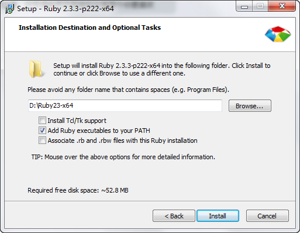

# 使用 SCSS + gulp + LiveReload 无刷新更新页面样式

**Version 1.0.0**

from 小熊

----

在工作中我们使用 CSS 预编译语言 SASS 来提高工作效率，特别能对移动端 px → rem 进行自动换算，SASS 有 sass 和 scss 两种语法，前面一种跟常规的 css 完全不同，学习起来略麻烦，所以我们使用 scss（跟 less 类似）

SCSS 的相关知识大家可以在网上自行搜索学习，这里主要说说工具的使用

### 工具安装

开发中主要使用 gulp / gulp-ruby-sass / gulp-sourcemaps / gulp-livereload 这些工具组合，其中 gulp-ruby-sass 因为依赖 ruby 和 sass 的命令行工具，所以必须先安装之：

#### 安装 ruby

[下载地址点这里](https://rubyinstaller.org/downloads/)，根据需要下载适合自己的版本，然后安装

注意图片中的第二个选项请一定要勾选，目的是把 ruby 加入全局环境变量中，这个不选，以后使用起来会出问题

#### 安装 sass

安装完 ruby 之后，可以打开 cmd 在里面输入 `ruby --version`，如果能显示版本号，说明 ruby 安装成功

安装 sass：在 cmd 中输入 `gem install sass`，因为国内网络问题，所以如果安装不动，请翻墙后再试

#### 安装 gulp

gulp 需要全局安装一下，打开 cmd 输入 `npm install gulp -g`

（npm 由安装 [nodejs](https://nodejs.org/zh-cn/download/) 的时候自带，安装完毕之后，由于国内网络问题，建议更换到 cnpm，安装方式在[这里](http://npm.taobao.org/)）

安装完毕之后，把这个项目中的 `package.json` 和 `gulpfile.js` 引入自己的项目中

### 工具使用

把 `package.json` 和 `gulpfile.js` 放入到项目的合适目录之后，打开 cmd 输入命令 `cnpm install` 或者  `npm install`，等待工具的依赖都完成安装

在 `scss` 目录中放入相对应的 `*.scss` 文件，使用后启动 cmd，输入命令 `gulp sass-watch` 即可进行开发

在 chrome 浏览器中安装 [LiveReload 插件](https://chrome.google.com/webstore/detail/livereload/jnihajbhpnppcggbcgedagnkighmdlei)，安装完毕之后，在开发的页面上，点击工具栏图标，启用 LiveReload，这样就能在保存修改 SCSS 文件后，浏览器自动更新页面上编译好的 css，达到无刷新页面即更新样式的目的（页面上 LiveReload 启用成功的时候，图标正中间应该是个**实心黑点**，如下图，如果是未启用状态或者启用失败，那么图标正中间是个**空心圈**）

### 相关说明

- 如果是编写在线的页面，那么请使用 [Fiddler](http://www.telerik.com/fiddler) 把在线的 CSS 文件映射到本地编译好的文件上，可以在线无刷新预览效果
- `gulpfile.js` 文件里，默认的路径是：scss 文件放在 `scss` 目录中，编译好的 css 文件放在 `css` 目录中，与 scss 文件对应的 sourcemaps 文件放在了 `scss-maps` 目录中
- sass 在编译过程中会产生 `.sass-cache` 这个目录，请大家在 `.gitignore` 文件中加入它，以免不小心传到了 git 仓库里
- `gulpfile.js` 文件里默认是对 `scss` 目录中所有的 SCSS 文件进行编译处理，大家在实际开发的过程中，可以跟据自己的需要修改文件、目录等相关的资源配置情况

### 结语

有能提高效率的工具，大家都努力用起来，有更好的工具，大家可以相互交流分享~

tips：.gitignore文件内可写入忽视上传的文件